# Keyboard and Mouse Tools

## Data Dam and streams

The component called `Data Dam` can be incredibly helpful when working with rapidly changing data.

`Data Dam` *buffers* input, or slows down the rate of input, by checking the input every once in a while (i.e. once every second) and setting that as output. By right-clicking on `Data Dam`, you can set the rate of change to go from 0.25 seconds to 10 seconds.

This is incredibly helpful when you are working with data coming from a constantly-changing input source -- such as keyboards, mice, cameras, audio streams, Kinects, Leap Motion, etc. In the example below, you can see what happens when you use `Data Dam` to buffer mouse input. 

The mouse input component (`mouse`) is from the plugin `InteracTool`, downloadable at . The component outputs the location of the mouse pointer on the xy plan, an infinitely long line that passes through the camera and the mouse pointer, among other nifty outputs.

`Data Dam` is helpful in a lot of ways. For example, you can use it to detect whether a value has changed, by comparing a value and its output. Since `Data Dam` 'lags' behind a bit behind the changed value, the comparison will answer the question: "is data changing?"
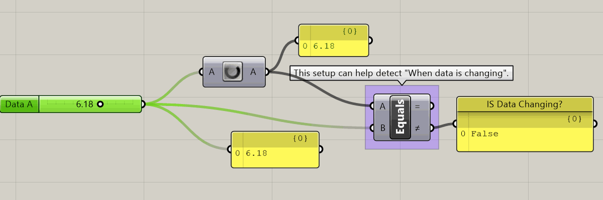

`Stream Filter` can operate like a switch -- given an input 'gate' command, it can distribute data to one of many different outputs. Think of it like a railroad track switch, able to send lots of data to many different directions.

If you zoom into `Stream Filter`, you can edit the number of outputs so that the component can distribute data to four different outputs, for example.

Using the `Stream Filter` component with `Data Dam`, you can pass data through only when it's changed. This is helpful when you want to record data (using `Record Data`, or `Data Log` from the `Firefly` plugin), or you want to trigger something only when new data is received.
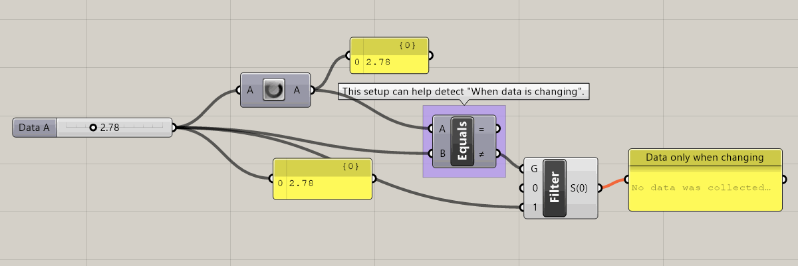

## Selecting objects with the mouse

`Objects by Selection` (or `SelObj` to be short)  is a component that's part of the [`Human` plugin suite ](https://www.food4rhino.com/app/human). It will reference any geometry that is currently being selected in Rhino.

You need to attach a `Timer` object it so that it checks for currently selected objects at a given interval. The `Timer` is a special component that tells the components it's attached to, to 'refresh' their answer. Or, in Grasshopper parlance, this would be 'telling the component to 'expire its solution'. Everything 'downstream' of the component -- that is, everything that's connected to the component's output, 
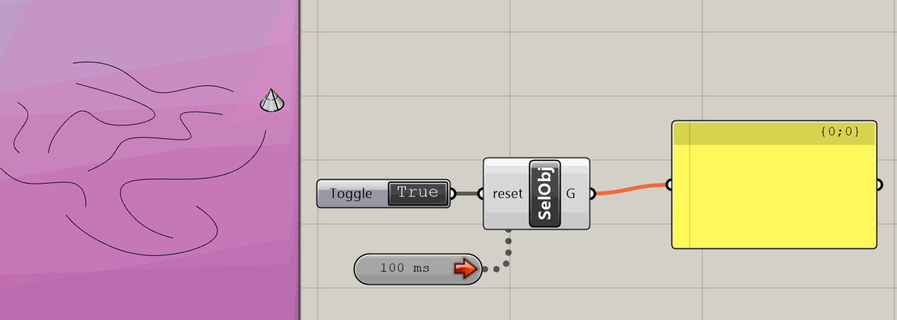
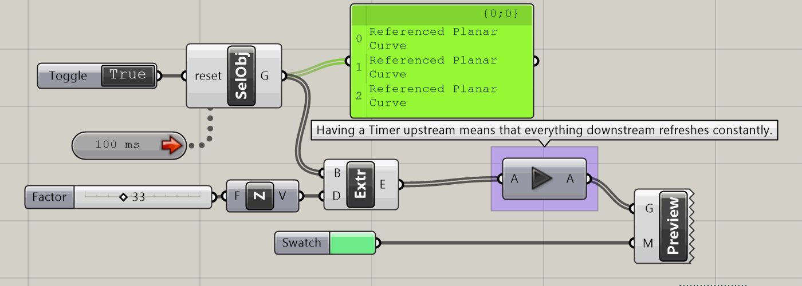
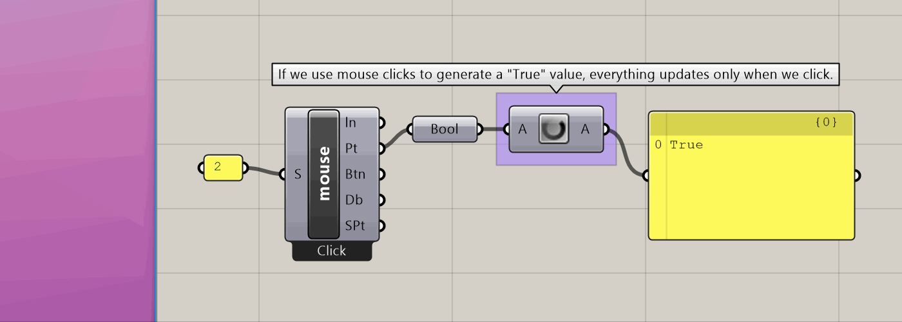
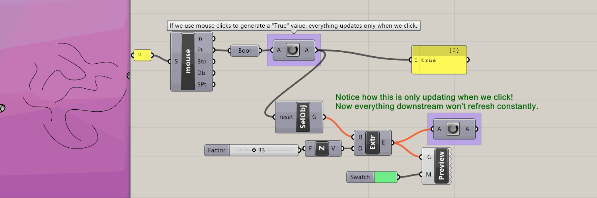

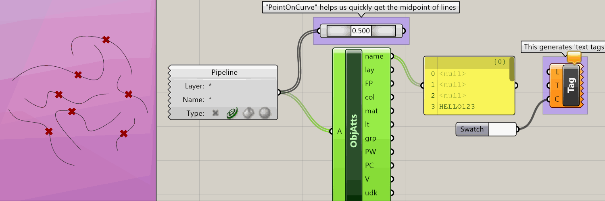
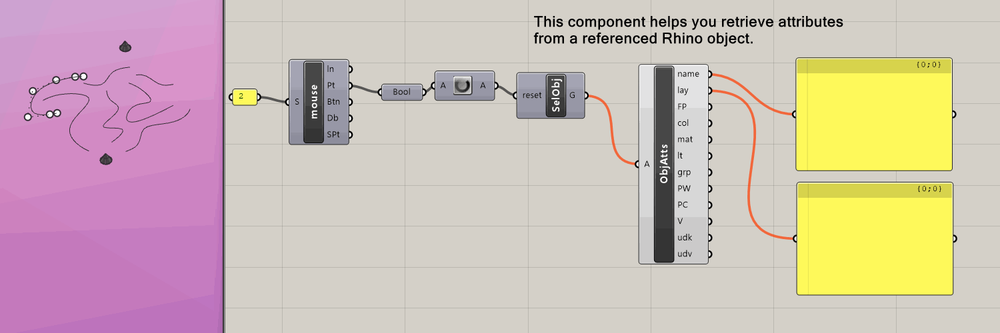
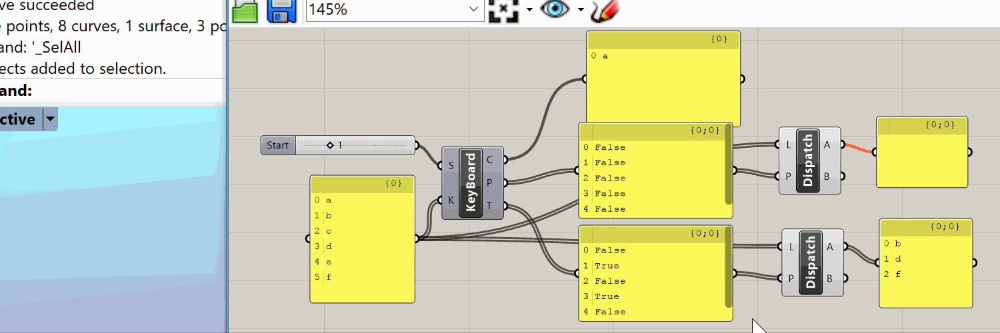

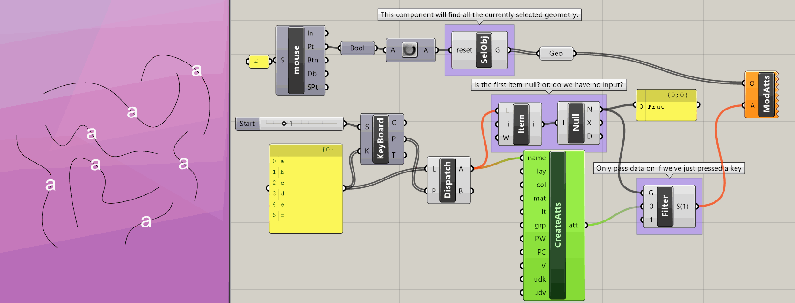

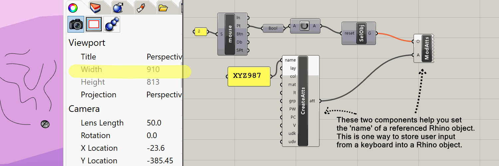

