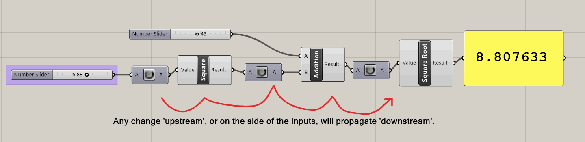

# Keyboard and Mouse Tools

This document is an example-based introduction to Keyboard and Mouse tools -- as well as a few tricks/hacks for using these tools!

## Data Dam and streams

The component called `Data Dam` can be incredibly helpful when working with rapidly changing data.

`Data Dam` *buffers* input, or slows down the rate of input, by checking the input every once in a while (i.e. once every second) and setting that as output. By right-clicking on `Data Dam`, you can set the rate of change to go from 0.25 seconds to 10 seconds.

This is incredibly helpful when you are working with data coming from a constantly-changing input source -- such as keyboards, mice, cameras, audio streams, Kinects, Leap Motion, etc. In the example below, you can see what happens when you use `Data Dam` to buffer mouse input. 

The mouse input component (`mouse`) is from the plugin `InteracTool`, downloadable at . The component outputs the location of the mouse pointer on the xy plan, an infinitely long line that passes through the camera and the mouse pointer, among other nifty outputs.

`Data Dam` is helpful in a lot of ways. For example, you can use it to detect whether a value has changed, by comparing a value and its output. Since `Data Dam` 'lags' behind a bit behind the changed value, the comparison will answer the question: "is data changing?"

`Stream Filter` can operate like a switch -- given an input 'gate' command, it can distribute data to one of many different outputs. Think of it like a railroad track switch, able to send lots of data to many different directions.

If you zoom into `Stream Filter`, you can edit the number of outputs so that the component can distribute data to four different outputs, for example.

Using the `Stream Filter` component with `Data Dam`, you can pass data through only when it's changed. This is helpful when you want to record data (using `Record Data`, or `Data Log` from the `Firefly` plugin), or you want to trigger something only when new data is received.

## Selecting objects with the mouse, and on Timers

`Objects by Selection` (or `SelObj` to be short)  is a component that's part of the [`Human` plugin suite ](https://www.food4rhino.com/app/human). It will reference any geometry that is currently being selected in Rhino.

However, by default, the component will only run once, even if you select different things. This is because nothing 'upstream' of the component has expired. 

A quick note on how solution expiration in Grasshopper works: each component in Grasshopper only recomputes/re-runs when one of its inputs has changed. When the component runs, it will update its outputs. Anything connected to it's outputs will then recompute also, updating outputs again, and so on and so forth. 

When a component's input changes, Grasshopper declares that the component's solution has 'expired' -- that is, the solution that the component was holding until now is now longer valid, since now the component input has changed. For example, if the 'x^2' component had an input of `7`, then the component's output would be `49`. But if the input changes to something else, say, `11`, then the component declares that its solution is expired, recalculates its solution (`121`), and pushes it to the output. 

For the `SelObj` component -- since its inputs are not affected by what happens in Rhino, a solution expiration will not be triggered even if new things are selected in Rhino, and the component's outputs will not change. 

To solve this, you can attach a `Timer` object to the `SelObj` component. The `Timer` is a special component that tells the components it's attached to continually expire its solution every X seconds. Everything 'downstream' of the component -- that is, everything that's connected to the component's output, will also thus refresh every X seconds. Using the `Timer`, you can get objects that are selected!

If you extrude them and make them look nice, it starts to feel kind of like magic.

However, one of the downsides of the `Timer` is its upside: Everything refreshes often, which is great, and everything refreshes often, which can make your script run slow. Imagine if your script takes 500ms to run, and the Timer tries to run every 250ms. This can lead to some major slowdowns.

So - one trick/hack/solution is to use other inputs other than the `Timer` to trigger a solution expiration, and thus a refresh. 

In the example below, the output of the mouse click is plugged into a `Boolean` component, and then plugged into a `Data Dam` so we can see what's going on. The `Boolean` component stores either True or False, but when it receives data other than the two, 0 is interpreted as False, and anything other than 0 will be considered to be True. 

So, since the output of the `mouse` component's point will pretty much never by exactly zero, this is quick hack to generate a 'True' value that will update each time you click. We've created an output that will always be True, but will just 'refresh' its' value whenever you click.

This means that we can harness this refreshing 'True' value and plug it into the `SelObj` component. Since selecting objects with the mouse involves a mouse click, every time you select an object in Rhino with the mouse, the mouse click will also trigger a scan by the `SelObj` component.

We do need to add a `Data Dam` so that the `SelObj` component scanned for selected objects a tiny bit after you've already selected an object, so the order of operations goes like this:

- You start selecting an object in Rhino, which triggers a click
- The click enters the data dam
- You finish selecting an object in Rhino
- The click exits the data dam, and triggers `SelObj`
- `SelObj` scans for selected objects, and finds the object that you newly selected.

## Working with Geometry Names to store information

One helpful trick is to use geometry names to store information about a piece of geometry. All geometry in Rhino have names, and you can see them in the Properties tab. Names aren't exclusive --- multiple objects/geometry can have the same name, and you can select objects by name in Rhino using `SelName`, but names don't seem to be used that often. (Or, at least, I don't use them that often in Rhino).

However, they can come in super handy in Grasshopper.

Below, we use the `Human` plugin's `Object Attributes` component, as well as the `Text Tag` component to display the name of each curve at its midpoint. `Object Attributes` will get all the information about a referenced Rhino object, including Layer name, display color, name, et cetera.

If we combine this with our `SelObj` process above, we can have a script that displays the names of selected geometry. Pretty nifty.

We can also set attributes -- using the `CreateAtts` and `ModAtts` (Create Attributes / Modify Attributes) components. `CreateAtts` will help you compose a series of attributes, and `ModAtts` will set those attributes to the geometry you put into it.

This means that you can both get and set the attributes of all Rhino objects.

## Keyboard Input

With the `InteracTool` plugin, we can also receive keyboard input. This is super nifty! 

(It can also be a little complicated, since any keyboard input will also be interpreted in Rhino as a potential keyboard command. If you do use the keyboard as input into Grasshopper, it means that you might have to alternate between typing keys and pressing `esc` to discard what you have typed so far in Rhino.)

The `Keyboard` component can take an input of 'keys to scan for', and will return a boolean list of true/false values based on "which key was triggered", or "which key was toggled", so you can treat each key as a trigger event (like pressing a button) or as a toggle switch (like turning something off/on).

Coupled with a `Dispatch` component, you can see how the results can be displayed/processed.

Let's get a little fancy. 

We can retrieve data from the keyboard. Using a `List Item` component and a `Null` (Null Items) component, we can check if the data we've received is not null. (If it's null, it means that we've pressed escape, or some other key.) Using the `Stream Filter` component (which, as I said above, can operate like a train track switch), we can pass on the attributes only if we have a non-null keyboard input to pass on.

What this does is that it prevents us from accidentally passing on attributes with a blank name, and erasing the names of objects whenever we select them. This is a little hard to explain, so feel free to play around with deleting the `Null`/`Stream Filter` stuff and plugging it in directly to the `ModAttr` component.

Using this script, you can highlight geometry with a mouse, hit a key from `a` to `f`, and can set the geometry to have that name. 

## Wallmaker with Keyboard example

Here's a final example, tying together, the `Data Dam`, `Mouse` input, `Keyboard` input, and attributes. You can select curve geometry, hit a key, and a wall will be created of that specific type. You can hit a different key, and a different wall will be created. You can edit the curves, delete them, or create new ones.

Hopefully you can begin to see how this starts to approximate an interface -- the Grasshopper script begins to take on *affordances*, how you might start prototyping and revising things differently through this tool.

