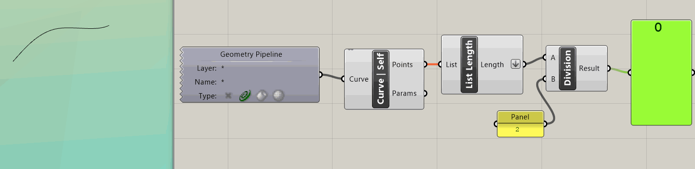
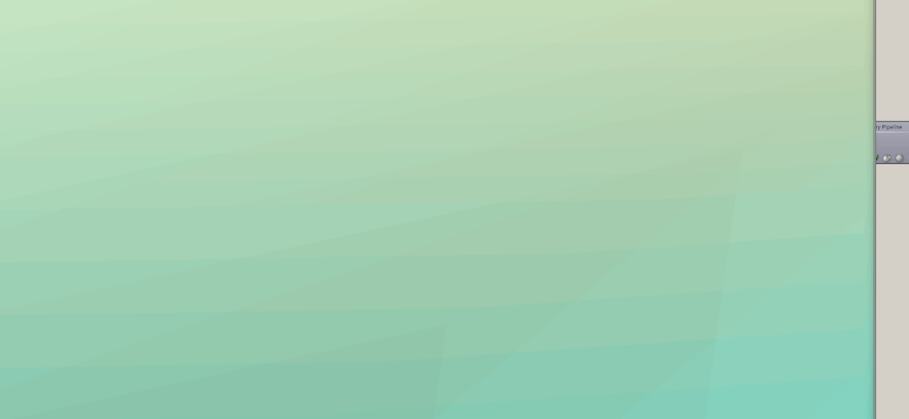

# SketchGestures

Here's a simple example of using 'gestures' to control a tool -- effectively embedding control into the geometry.

This is incredibly helpful when you are working with data coming from a constantly-changing input source -- such as keyboards, mice, cameras, audio streams, Kinects, Leap Motion, etc. In the example below, you can see what happens when you use `Data Dam` to buffer mouse input. 

The mouse input component (`mouse`) is from the plugin `InteracTool`, downloadable at . The component outputs the location of the mouse pointer on the xy plan, an infinitely long line that passes through the camera and the mouse pointer, among other nifty outputs.
